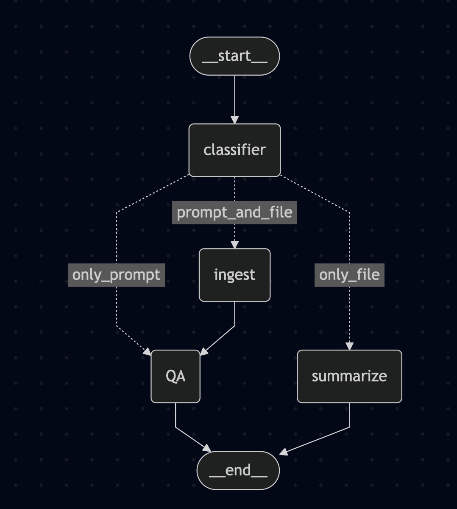
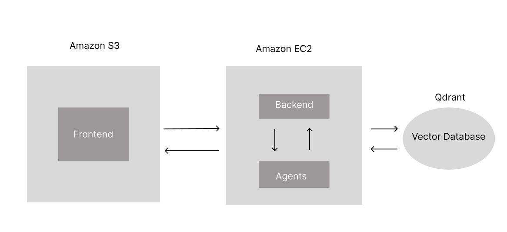

# Cloud-based Multi-Agent Document Analysis Assistance Chatbot

## Overview
This project presents a cloud-based multi-agent document analysis chatbot designed to improve how users retrieve and analyze information from large document collections.

With the rapid growth of digital text across domains such as research, law, and finance, manual document review has become inefficient, time-consuming, and error-prone. This system automates document summarization, question answering, and classification.

The platform integrates Google Gemini for language understanding and Qdrant for semantic search, enabling fast and context-aware information retrieval.

---

## Key Features
- Multi-agent AI architecture for task specialization  
- Retrieval-Augmented Generation (RAG) pipeline  
- Semantic document search using vector embeddings  
- Automated summarization and question answering  
- Cloud deployment for scalability  
- Modular and extensible system design  

---

## Problem Statement
Knowledge workers frequently deal with large volumes of documents such as PDFs, reports, and manuals. Extracting relevant information manually leads to high time consumption, cognitive overload, and increased risk of errors.

This project builds an intelligent chatbot that processes documents automatically and delivers precise, contextual insights.

---

## Architecture Overview

### Pipeline
1. Document ingestion (text extraction and preprocessing)  
2. Embedding and indexing using Gemini  
3. Storage in Qdrant vector database  
4. Query handling via FastAPI  
5. Multi-agent orchestration using LangGraph  
6. Frontend interaction through React  

---

## Tech Stack

- Programming Language: Python  
- LLM: Google Gemini  
- Vector Database: Qdrant  
- Backend: FastAPI  
- Frontend: React  
- Cloud Platform: AWS (EC2, S3)  
- Agent Framework: LangChain  
- Orchestration: LangGraph  

---

## AI Techniques

- Embeddings and Retrieval: Semantic search using Gemini embeddings with Qdrant  
- Summarization: Abstractive summarization using large language models  
- Question Answering: Retrieval-Augmented Generation (RAG)  
- Multi-Agent Coordination: Task-specific agents coordinated via LangGraph

  
   
  <em>Agent Communication</em>

---

## Use Cases

- Legal document review (summarizing case files and retrieving precedents)  
- Academic research (extracting key findings from papers)  
- Corporate knowledge management (organizing internal documents)  
- Helpdesk systems (retrieving support knowledge quickly)  

---

## Future Improvements

- Add agents for entity extraction, sentiment analysis, and translation  
- Domain-specific fine-tuning (legal, medical, finance)  
- Hybrid search (dense + sparse retrieval)  
- Real-time collaboration features  
- Human-in-the-loop evaluation  
- Security improvements (encrypted embeddings)  
- Multimodal support (OCR and vision-language models)  
- Scalable deployment (serverless and distributed vector databases)  

---

## Deployment Notes

- Built using AWS free-tier resources  
- Backend hosted on EC2  
- Document storage via S3  
- Resource limitations influenced design choices  

  
   
  <em>Cloud (AWS) Deployment</em>

